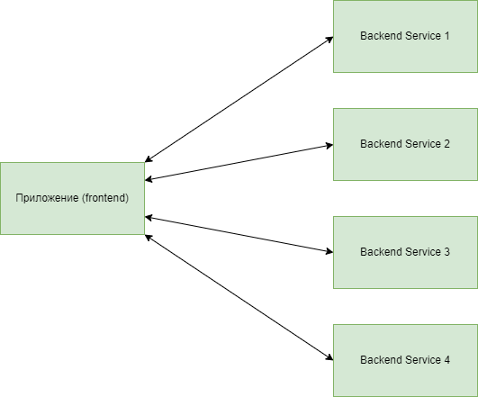
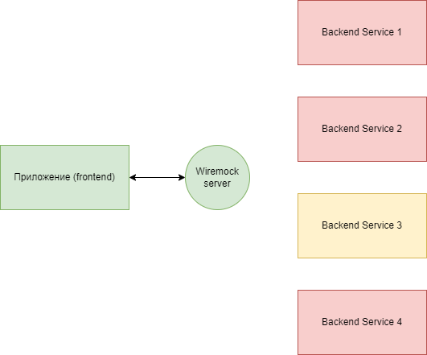

# Wiremock

## Для чего нужен Wiremock?

В больших распределённых системах часто возникают ситуации, когда один или несколько сервисов работают некорректно. Это 
ведёт к тому, что тестируемая система начинает сбоить и блокировать тестирование, тем самым возможны задержки в разработке 
и поставке нового функционала для бизнеса. Для большого продукта это очень критично в виду того, что подобные задержки 
ведут к общему увеличению стоимости нового функционала.

Типичная схема взаимодействия сервисов выглядит следующим образом:



Проблемы на стороне какого-либо сервиса ведут к тому, что вся система работает некорректно:


Для того, чтобы избежать таких ситуаций во многих командах в Леруа для тестов стараются минимизировать зависимость от 
сторонних сервисов, используя вместо них заглушки (mocks, моки). Наиболее удобным инструментом для создания заглушек 
является Wiremock.

Тестируемая система настраивается таким образом, чтобы в качестве backend (back, бэк) использовался Wiremock:



## Установка Wiremock

Для запуска Wiremock-сервера можно использовать Docker и официальный образ:
`docker run -it --rm -p 8080:8080 --name wiremock wiremock/wiremock:3.0.4`

После скачивания и монтирования образа, Wiremock-сервер будет доступен по адресу: `http://localhost:8080/`

## Взаимодействие с Wiremock

Взаимодействие с запущенным Wiremock-сервером осуществляется посредством отправки HTTP-запросов в двух направлениях:
1. Администрирование.
2. Вызов сохранённых заглушек.

### Администрирование

Администрирование позволяет осуществлять различные манипуляции с сервером. Для этого существует REST API интерфейс 
`http://localhost:8080/__admin/{handler}`. С помощью этого интерфейса возможно (в скобках название ручек):
- управление заглушками (mappings);
- журналирование запросов (requests);
- учёт некорректных заглушек (near-misses);
- запись событий (recordings);
- управление состояниями сценариев (scenarios);
- изменение системных настроех Wiremock-сервера (settings, reset, shutdown).

Для получения детальной информации по доступным методам можно перейти по адресу `{wiremock_url}/__admin/swagger-ui/`.

### Вызов сохранённых заглушек

Вызов заглушек осуществляется выполнением HTTP-запроса на адрес `http://localhost:8080/{mock_path}`, где `mock_path` – 
путь к заглушке, которая ранее была загружена через интерфейс администрирования для управления заглушками.

## Работа с заглушками на примере Postman-коллекции:

**ВНИМАНИЕ!** Все совпадения случайны.

Для интерактивного знакомства с возможностями Wiremock-сервера, добавим некоторые вводные. Пусть в качестве тестируемой
системы у нас будет веб-приложение оформления заказа в интернет-магазине. В интернет-магазине можно делать заказы только 
на самовывоз, а оплачивать наличными при получении.

Приложение будет состоять из трёх страниц:
- корзина;
- оформление заказа;
- спасибо за покупку.

Вот описание бэка, с которым будет взаимодействовать наш frontend (front, фронт):


На каждой странице вызываются свои методы.

Так, на странице корзины вызываются:
- `GET products` (получает расширенную информацию о товарах по их кодам);
- `POST orders` (создаёт черновик заказа).

На странице оформления вызываются:
- `POST ffo` (создаёт черновик заявки на самовывоз);
- `PUT ffo` (устанавливает пункт самовывоза в заявке на самовывоз для будущего заказа);
- `PATCH orders` (вносит изменения в заказ, например, при вводе ФИО);
- `POST confirm` (подтверждает оформление заказа).

На странице "Спасибо за покупку" вызывается метод `GET orders` (отображает покупателю информацию о созданном заказе).

Так как ни описанного сервиса, ни фронта не существует, мы просто будем симулировать их работу с помощью Postman и 
Wiremock.

> Используем Postman, чтобы не опираться на голую теорию и добавить немного интерактива. В 
> [этой коллекции](postman_wiremock.json) можно найти пару примеров взаимодействия с этим сервисом, а также 
> необходимые заглушки.
> Последовательность использования коллекции следующая:
> - запустить Wiremock-сервер;
> - отправить заглушки из коллекции на запущенный сервер;
> - отправлять запросы к заглушкам сервиса.

В данной коллекции для отправки заглушек на запущенный Wiremock-сервер используется метод 
`POST /__admin/mappings/import`. В него передаётся массив заглушек в следующем виде:
```
{
    mappings" : [
        {заглушка 1},
        {заглушка 2}
    ]
}
```

Для заглушки минимальный набор параметров может быть следующим:
```
{
    "request": {
        "method": "GET",
        "urlPath": "/api/products/",
        "queryParameters": {
            "in_cart": {
                "equalTo": "10001:1,10002:3,10005:20.5"
            }
        }
    },
    "response": {
        "status": 200,
        "headers": {
            "Content-Type": "application/json"
        },
        "jsonBody": [
            {
                "id": "10001",
                "name": "Рюкзак Erhaft Star M-2357",
                "stock": 12,
                "weight": 15.5
            },
            {
                "id": "10002",
                "name": "Пюре ФрутоНяня из говядины с овощами 100 г с 8 месяцев",
                "stock": 60,
                "weight": 2.3
            },
            {
                "id": "10005",
                "name": "Каша Fleur Alpine безмолочная гречневая гипоаллергенная 175г с 4мес",
                "stock": 5.5,
                "weight": 1
            }
        ]
    }
}
```

Заглушка состоит из:
1. `request` – объект, описывающий запрос, по которому Wiremock-сервер определяет запрошенную заглушку.
2. `response` – объект, описывающий ответ, который возвращается при запросе заглушки.

|            |                   | Описание поля                               |
|------------|-------------------|---------------------------------------------|
| `request`  |                   |                                             |
|            | `method`          | HTTP-метод запроса                          |
|            | `urlPath`         | путь до заглушки без учёта query-параметров |
|            | `queryParameters` | объект, описывающий query-параметры запроса |
| `response` |                   |                                             |
|            | `status`          | HTTP-код статуса ответа                     |
|            | `headers`         | объект, описывающий заголовки ответа        |
|            | `jsonBody`        | JSON-объект (или массив) с телом ответа     |

Рассмотрим подробнее доступные параметры заглушек, которые чаще всего используются. Часть из них можно увидеть в 
Postman-коллекции.

### `urlPath`, `urlPathTemplate`, `urlPathPattern`

Определяют путь до заглушки. Разница между ними описана в таблице ниже.

| Параметр          | Описание                                                                                                   |
|-------------------|------------------------------------------------------------------------------------------------------------|
| `urlPath`         | относительный путь до заглушки без учёта query-параметров. Может использоваться вместе с `queryParameters` |
| `urlPathTemplate` | относительный путь до заглушки с path-параметрами. Используется вместе с `pathParameters`                  |
| `urlPathPattern`  | относительный путь до заглушки, с использованием регулярных выражений                                      |

> В одной заглушке используется только один из параметров пути.

### `queryParameters`

Определяет query-параметры (то, что передаётся в строке запроса после символа `?`). Пример:

```
url/path?param1=value1&param2=value2
```

В Wiremock применяется следующим образом:
```
"urlPath": "/api/products/",
"queryParameters": {
    "in_cart": {
        "equalTo": "10001:1,10002:3,10005:20.5"
    }
}
```

> Внутри `queryParameters` могут быть использованы операторы сравнения и логические операторы.

### `pathParameters`

Определяет path-параметры (то, что передаётся в строке запроса). Пример:

```
url/path/value1/value2
```

В Wiremock применяется вместе с `urlPathTemplate` следующим образом:
```
"urlPathTemplate": "/api/ffo/{ffo_id}/",
"pathParameters": {
    "ffo_id": {
        "equalTo": "882"
    }
}
```

> Внутри `pathParameters` могут быть использованы операторы сравнения и логические операторы.

### `bodyPatterns`

Определяет шаблон тела запроса.

В Wiremock применяется следующим образом:
```
"urlPath": "/api/orders/",
"bodyPatterns": [
    {
        "equalToJson": {
            "products": [
                {
                    "id": "10005",
                    "quantity": 20.5
                },
                {
                    "id": "10002",
                    "quantity": 3
                },
                {
                    "id": "10001",
                    "quantity": 1
                }
            ]
        },
        "ignoreArrayOrder": true
    }
]
```

> Внутри `bodyPatterns` могут быть использованы параметры `ignoreArrayOrder`, `ignoreExtraElements`, а также операторы 
> сравнения и логические операторы.

### `ignoreArrayOrder`, `ignoreExtraElements`

| Параметр              | Описание                                                                                                                                      |
|-----------------------|-----------------------------------------------------------------------------------------------------------------------------------------------|
| `ignoreArrayOrder`    | не учитывать порядок элементов массива/объекта (`["asd", "qwe"]` будет равно `["qwe", "asd"]`)                                                |
| `ignoreExtraElements` | не учитывать элементы, которые не перечислены в `bodyPatterns` (под шаблон `{"example": 1}` подойдёт объект `{"test": "test", "example": 1}`) |

`False` – значение по умолчанию для обоих параметров.

> Эти параметры применяются с `bodyPatterns`.

### `equalTo`, `equalToJson`, `contains`, `matches`

Операторы сравнения. Могут быть использованы для проверки любых параметров.

| Параметр      | Описание                                                                         |
|---------------|----------------------------------------------------------------------------------|
| `equalTo`     | проверяет точное соответствие (`"abc" equalTo "abc"`)                            |
| `equalToJson` | проверяет соответствие JSON-объекту (или массиву). Используется в `bodyPatterns` |
| `contains`    | проверяет вхождение (`"abc" contains "b"`)                                       |
| `matches`     | проверяет соответствие регулярному выражению (`"abc" matches ".b."`)             |

### `and`, `or`

Логические операторы. Позволяют объединять несколько условий.

Эта заглушка сработает двух случаях:
- когда в query передаётся значение `in_cart=10001:1,10002:3`;
- когда в query передаётся значение `10005:20.5`.
```
"urlPath": "/api/products/",
"queryParameters": {
    "in_cart": {
        "or": [
            {
                "equalTo": "10001:1,10002:3"
            },
            {
                "equalTo": "10005:20.5"
            }
        ]
    }
}
```

А эта сработает только в одном случае: когда `in_cart` содержит оба значения – `10001` и `10005` (например, 
`10001:1,10002:3,10005:20.5`).
```
"urlPath": "/api/products/",
"queryParameters": {
    "in_cart": {
        "and": [
            {
                "contains": "10001"
            },
            {
                "contains": "10005"
            }
        ]
    }
}
```

## Использование Wiremock для нагрузочных тестов.

Wiremock обладает существенным быстродействием в виду того, что при подготовке ответа на запрос от клиента отсутствует 
какая-либо сложная логика, которая есть у реального сервиса. Для нагрузочного тестирования необходимо применение 
параметров максимально приближённых к реальным.

Wiremock позволяет симулировать различные ситуации, в частности управлять задержкой ответа (latency), возвращать битые 
ответы или обрывать соединение с клиентом.

### Управление задержкой ответа

Установка задержки ответа на заглушки означает, что ответ не будет возвращён клиенту, пока не прошло указанное в 
параметрах время. Wiremock поддерживает несколько вариантов управления задержкой ответа.

#### Фиксированная задержка

Устанавливает одинаковое время ответа на запрос. Чтобы применить глобально сразу ко всем заглушкам, необходимо  
отправить запрос `POST /__admin/settings` с телом:
```
{
    "fixedDelay": 500
}
```

Для применения на конкретную заглушку, необходимо добавить параметр `fixedDelayMilliseconds`:
```
{
    "request": {
        "method": "PUT",
        "urlPathPattern": "/api/ffo/.*"
    },
    "response": {
        "status": 400,
        "fixedDelayMilliseconds": 2000,
        "headers": {
            "Content-Type": "application/json"
        },
        "jsonBody": {
            "error": "Pickup point doesn't exist!"
        }
    }
}
```

#### Логнормальное распределение задержки

Устанавливает случайное значение времени задержки. При генерации используются следующие параметры:
- `median` – среднее время ответа. Так называемая задержка 50-го перцентиля. Означает, что 50% ответов на запросы 
будут возвращены быстрее этого времени;
- `sigma` – стандартное отклонение. Чем больше это значение, тем дольше может быть ожидание ответа (отклонение от 
среднего времени ответа).

Для глобального применения необходимо отправить запрос `POST /__admin/settings` с телом:
```
{
    "delayDistribution": {
        "type": "lognormal",
        "median": 90,
        "sigma": 0.1
    }
}
```

Для применения на конкретную заглушку:
```
{
    "request": {
        "method": "PUT",
        "urlPathPattern": "/api/ffo/.*"
    },
    "response": {
        "status": 400,
        "delayDistribution": {
            "type": "lognormal",
            "median": 90,
            "sigma": 0.1
        },
        "headers": {
            "Content-Type": "application/json"
        },
        "jsonBody": {
            "error": "Pickup point doesn't exist!"
        }
    }
}
```

#### Равномерное распределение задержки

Устанавливает случайное значение задержки из заданного диапазона. При генерации используются следующие параметры:
- `lower` – минимальная задержка;
- `upper` – максимальная задержка.

Для глобального применения необходимо отправить запрос `POST /__admin/settings` с телом:
```
{
    "delayDistribution": {
        "type": "uniform",
        "lower": 300,
        "upper": 500
    }
}
```

Для применения на конкретную заглушку:
```
{
    "request": {
        "method": "PUT",
        "urlPathPattern": "/api/ffo/.*"
    },
    "response": {
        "status": 400,
        "delayDistribution": {
            "type": "uniform",
            "lower": 300,
            "upper": 500
        },
        "headers": {
            "Content-Type": "application/json"
        },
        "jsonBody": {
            "error": "Pickup point doesn't exist!"
        }
    }
}
```

#### Разбиение ответа на части

Wiremock может отправлять ответ на запрос клиенту по частям. Это полезно для симуляции медленного интернет-соединения. 
При генерации используются следующие параметры:
- `numberOfChunks` – количество частей, на которые будет разбито тело ответа;
- `totalDuration` – суммарное время, в течение которого весь ответ будет возвращён.

Для применения на конкретную заглушку:
```
{
    "request": {
        "method": "PUT",
        "urlPathPattern": "/api/ffo/.*"
    },
    "response": {
        "status": 400,
        "chunkedDribbleDelay": {
            "numberOfChunks": 5,
            "totalDuration": 1000
        },
        "headers": {
            "Content-Type": "application/json"
        },
        "jsonBody": {
            "error": "Pickup point doesn't exist!"
        }
    }
}
```

В данном примере тело будет разбито на 5 частей, каждая из которых будет отправляться клиенту раз в 200 миллисекунд.

### Ошибки при формировании ответов

Для отправки битых ответов применяется параметр `fault` при формировании конкретной заглушки. Допустимые значения 
параметра:
- `EMPTY_RESPONSE` – возвращает пустой ответ;
- `MALFORMED_RESPONSE_CHUNK` – отправляет OK в заголовках, затем мусор, а после закрывает соединение;
- `RANDOM_DATA_THEN_CLOSE` – отправляет мусор, затем закрывает соединение;
- `CONNECTION_RESET_BY_PEER` – возвращает ошибку "Connection reset by peer".

Пример:
```
{
    "request": {
        "method": "PUT",
        "urlPathPattern": "/api/ffo/.*"
    },
    "response": {
        "fault": "MALFORMED_RESPONSE_CHUNK"
    }
}
```

## Развёртывание и распределение нагрузки.

**TO BE DONE**

https://wiremock.org/docs/standalone/java-jar/
https://wiremock.org/docs/stubbing/
https://hub.docker.com/r/wiremock/wiremock

mappings через файл
Общий mappings для всех инстансов через Kubernetes или дублирование mappings для каждого инстанса.

